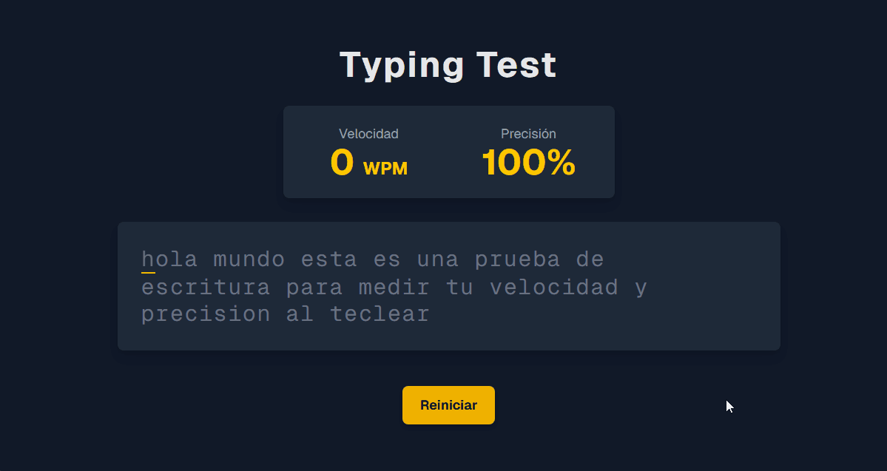

# Typing Speed App 🚀



> Una aplicación web interactiva para medir y mejorar la velocidad y precisión de escritura. El proyecto ofrece retroalimentación visual instantánea, coloreando cada carácter según sea correcto, incorrecto o haya sido corregido.

**Ver el proyecto en vivo:** [**https://typing-app-dave.vercel.app/**](https://typing-app-dave.vercel.app/)

---

## ✨ Características Principales

* **📊 Medición de WPM y Precisión:** Calcula la velocidad (Palabras Por Minuto) y el porcentaje de precisión en tiempo real.
* **🎨 Feedback Visual por Carácter:**
    * **Correcto:** Marca los caracteres tecleados correctamente.
    * **Incorrecto:** Resalta los errores al instante.
    * **Corregido:** Muestra los caracteres que fueron borrados y corregidos.
* **🔄 Botón de Reinicio:** Permite al usuario reiniciar la prueba en cualquier momento para comenzar de nuevo con el mismo texto.
* **⌨️ Enfoque en el Teclado:** La interfaz se centra en el texto y la entrada del usuario para una práctica sin distracciones.
* **📱 Diseño Responsivo:** Se adapta a diferentes tamaños de pantalla para practicar en cualquier dispositivo.

---

## 🛠️ Stack Tecnológico


---

## 🚀 Instalación y Uso Local

Para clonar y correr este proyecto en tu máquina local, sigue estos pasos:

1.  **Clona el repositorio:**
    ```bash
    git clone [https://github.com/TechDaveDev/typing-app.git](https://github.com/TechDaveDev/typing-app.git)
    cd typing-app
    ```

2.  **Instala las dependencias:**
    ```bash
    npm install
    ```

3.  **Inicia el servidor de desarrollo:**
    ```bash
    npm run dev
    ```

Abre [http://localhost:3000](http://localhost:3000) en tu navegador para ver la aplicación.